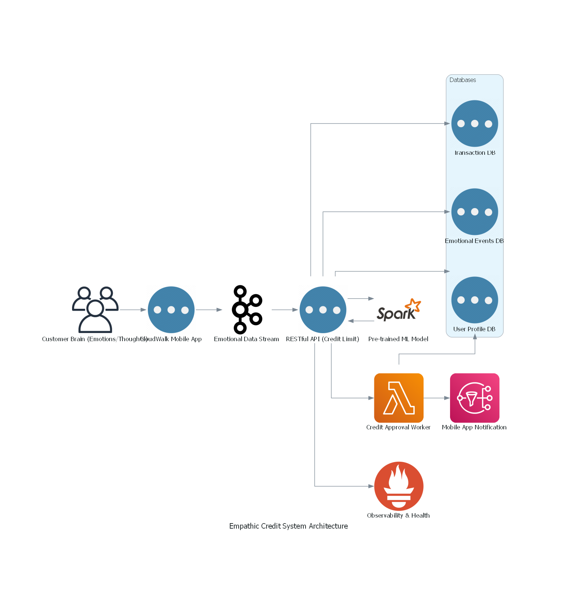

# CloudWalk Empathic Credit System - Customer-Centric Architecture

## 👤 Core Philosophy: Everything Revolves Around the Customer

This system architecture diagram places the **customer at the absolute center** of our design. Every component, every data flow, and every process exists to serve the customer's financial needs through their emotional intelligence.

## 📊 System Architecture Diagram

## 🎯 Customer-Centric Design Principles

### **🧠 Customer as the Primary Data Source**
- **Customer's Brain** is prominently positioned at the top center
- **Customer's Mobile App** acts as their personal credit assistant
- **Customer Dashboard** provides personal insights and control

### **💝 Customer-Named Components**
- **Customer Emotion Stream** (not just "data stream")
- **Customer Intelligence Engine** (personalized AI processing)
- **Customer Data Vault** (secure personal information)
- **Customer Service Workers** (dedicated background processing)

### **🔄 Customer Journey Flow**
- **Thick bold lines** for primary customer interactions
- **Color-coded phases** showing customer experience stages
- **Return path** ensuring customers receive personalized results

## 🔄 Customer Journey: 16 Steps from Brain to Benefit

### **Phase 1: Customer Emotion Capture** 
1. **🧠→📱** Customer's brain generates emotions → Personal mobile app captures them
2. **📱→🌊** Mobile app sends emotion events → Customer emotion stream processes them

### **Phase 2: Customer Service Processing**
3. **🌊→🔄** Real-time stream → Customer service APIs process immediately
4. **🔄→📮** APIs queue → Customer request queue for personalized handling
5. **📮→👥** Queue assigns → Customer service workers for dedicated processing

### **Phase 3: Customer Intelligence Analysis**
6. **👥→💡** Workers analyze → Customer credit engine for personalized decisions
7. **💡→🤖** Credit engine requests → Customer risk AI for personalized scoring
8. **🤖→💡** AI returns → Personalized risk score back to credit engine

### **Phase 4: Customer Data Management**
9. **👥→💝** Store → Customer emotions in personal feeling history
10. **💡→🎯** Generate → Personalized credit offers for customer
11. **💡→👤** Lookup → Customer profile and preferences
12. **💡→💳** Review → Customer's financial journey and transaction history

### **Phase 5: Customer Notification & Engagement**
13. **💡→📢** Credit approved → Customer notification system triggers
14. **📢→📱** Personalized offer → Delivered directly to customer's mobile app
15. **🔄→📊** Live analytics → Customer's personal dashboard updates
16. **👥→📊** Service insights → Enhanced customer dashboard experience

## 🏗️ Customer-Focused Components

### **👤 Customer Interface Layer:**
- **Customer's Brain**: The ultimate source of authentic emotional data
- **Personal Mobile App**: Customer's primary interaction point
- **Personal Dashboard**: Customer's view of their financial emotional journey
- **Customer Notifications**: Personalized credit offer delivery

### **💝 Customer Intelligence Stack:**
- **Customer Emotion Stream**: Real-time feeling processing
- **Customer Service APIs**: Dedicated customer processing endpoints
- **Customer Intelligence Engine**: Personalized AI decision making
- **Customer Risk AI**: Individual credit scoring models

### **🏦 Customer Data Vault:**
- **Customer Profile**: Personal identity and preferences
- **Customer Emotions**: Individual feeling history and patterns
- **Customer Transactions**: Personal financial journey tracking
- **Customer Credit Offers**: Tailored financial products

### **⚙️ Customer Service Infrastructure:**
- **Customer Request Queue**: Dedicated message processing
- **Customer Service Workers**: Background processing for individuals
- **Customer Session Cache**: Personal interaction state management

## 🌟 Customer-Centric Features

✅ **Customer-First Design**: Every component named and designed for customer benefit
✅ **Personal Emotion Processing**: Individual emotional intelligence analysis
✅ **Personalized Credit Decisions**: AI tailored to each customer's unique profile
✅ **Customer Dashboard**: Personal view of emotional and financial insights
✅ **Dedicated Customer Workers**: Background processing specifically for customer needs
✅ **Customer Feedback Loop**: Dashboard access directly from mobile app
✅ **Personal Notification System**: Customized credit offer delivery

## 🔒 Customer Privacy & Security

- **Customer Data Encryption**: Personal information protected at rest and in transit
- **Customer Authentication**: Secure access to personal financial services
- **Customer Audit Logging**: Transparent tracking of personal data usage
- **Customer Data Anonymization**: Privacy protection in analytics processing

## � Customer Experience Highlights

- **🧠 Emotional Intelligence**: Your feelings drive your financial opportunities
- **📱 Personal Assistant**: Mobile app as your credit companion
- **🤖 AI Personalization**: Credit decisions tailored specifically to you
- **📊 Personal Insights**: Dashboard showing your emotional-financial patterns
- **⚡ Real-time Response**: Instant processing of your emotional state
- **🎯 Tailored Offers**: Credit products designed for your unique profile

---

This **customer-centric architecture** ensures that every system component exists to serve the customer's financial well-being through their emotional intelligence, making them the true center of our empathic credit ecosystem.
